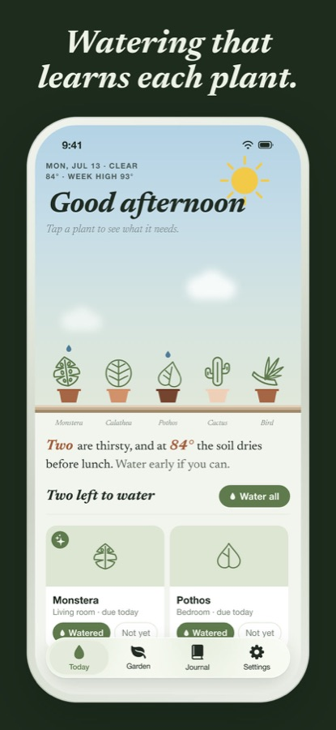
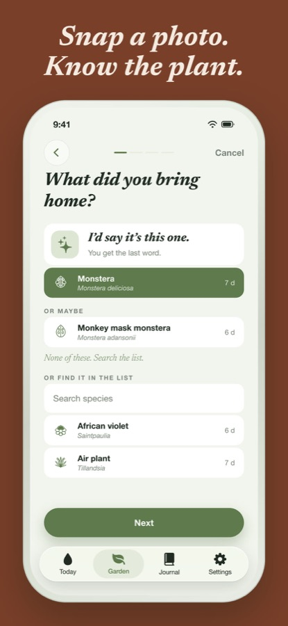
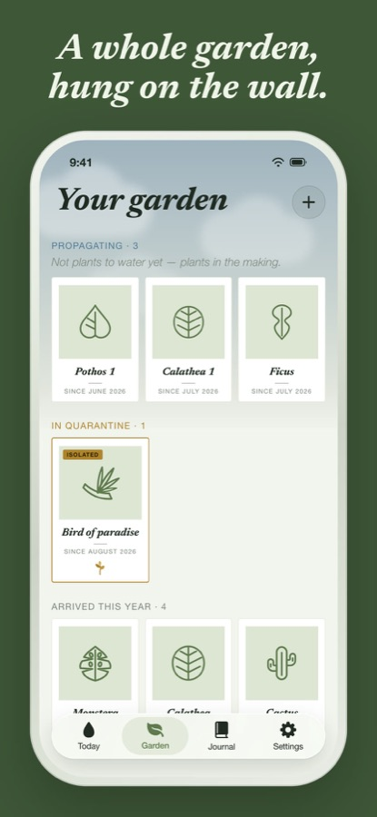

<a href="https://plantempo.app/?utm_source=github&utm_medium=readme">
  <picture>
    <source media="(prefers-color-scheme: dark)" srcset="assets/home-dark.svg">
    
  </picture>
</a>

  <a href="https://plantempo.app/?utm_source=github&utm_medium=readme"><b>Plantempo</b></a> ·
  <a href="https://apps.apple.com/app/id6789923852?pt=129157277&ct=github-readme&mt=8">App Store</a> ·
  <a href="https://play.google.com/store/apps/details?id=app.plantempo.Plantempo&referrer=utm_source%3Dgithub%26utm_medium%3Dreadme">Google Play</a> ·
  <a href="https://www.linkedin.com/in/gerardo-pacheco-sicart/">LinkedIn</a>

## Plantempo

A plant-care app I designed and built on my own. It reads your local weather, asks you to touch the soil now and then, and learns how fast each plant really dries. One reminder a day, only when it counts. Free, with no account and no ads.

  &nbsp;
  &nbsp;
  

**Under the hood:** Expo Router, React Native and TypeScript. Skia and Reanimated for the animated scenes, SQLite on the device, and native Swift modules for home-screen widgets, Siri shortcuts and iCloud sync. Plant identification runs on the device on iPhone. Translated into 11 languages with Lingui, released with fastlane.

## Version history

`17.0` · Jul 2026  
**Plantempo.** Launched my own plant-care app on iPhone and Android.  
Fixed: the monstera no longer gets watered twice.

`16.0` · Nov 2025  
**XRF.** Senior Software Engineer. Hybrid, Madrid.

`15.0` · Nov 2024  
**Sabbatical.** Three months off to recharge.  
Maintenance release. No new features, on purpose.

`10.0` · Nov 2019  
**Automattic.** Five years on the Gutenberg editor for the WordPress iOS and Android apps, fully remote: features, upgrades, UI, performance and test automation.  
Added: native bridges in Swift and Kotlin, Appium end-to-end tests.

`9.0` · Jul 2018  
**Lingokids.** Performance on older devices, deep links, Detox end-to-end tests and AppsFlyer attribution.

`8.0` · Jun 2017  
**Gudog.** Push and in-app notifications, WebSocket chat, deep links and Branch attribution.

`6.0` · Jan 2015  
**Vizzuality.** Front-end developer and team lead. D3 visualizations, interactive maps and my first React Native apps.

`3.0` · Feb 2012  
**TAPTAP Networks.** Mobile web with Backbone and Node.js.

`1.0` · Oct 2010  
**Creatibox.** Initial release: PHP, MySQL, WordPress and Joomla.

## Open source

Merged pull requests in [WordPress/gutenberg](https://github.com/WordPress/gutenberg/pulls?q=is%3Apr+author%3Ageriux+is%3Aclosed) and [wordpress-mobile/gutenberg-mobile](https://github.com/wordpress-mobile/gutenberg-mobile/pulls?q=is%3Apr+author%3Ageriux+is%3Aclosed).
